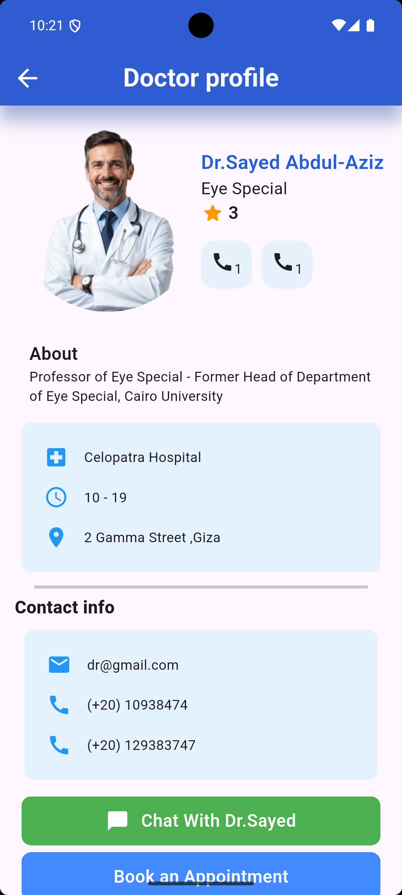

# 🩺 Doctor Profile App

A clean and simple Flutter application that showcases a doctor's profile in an elegant UI.  
The app is designed using basic Flutter widgets and focuses on static profile display.

## 📷 Screenshot



## ✨ Features

- Doctor profile picture and details
- Contact information
- Hospital name, working hours, and location
- Action buttons like **Chat with Doctor** and **Book Appointment**

## 🛠️ Used in the Project

- **Flutter & Dart**
- **Widgets**:  
  - `AppBar`, `Scaffold`, `Column`, `Row`, `Container`  
  - `Padding`, `Expanded`, `Image.asset`, `Text`, `Icon`, `Divider`, `Align`, `ClipOval`  
- **Layouts & Styling**: Basic use of `BoxDecoration`, `EdgeInsets`, colors, fonts
- **Assets**:
  - Doctor image loaded using `Image.asset`
- **pubspec.yaml**:
  - Used to include local images inside `assets/images/`

## 🚀 How to Run

1. Clone the repo:
   ```bash
   git clone https://github.com/iMarinaAdel/Doctor_Profile_App.git
   cd Doctor_Profile_App


